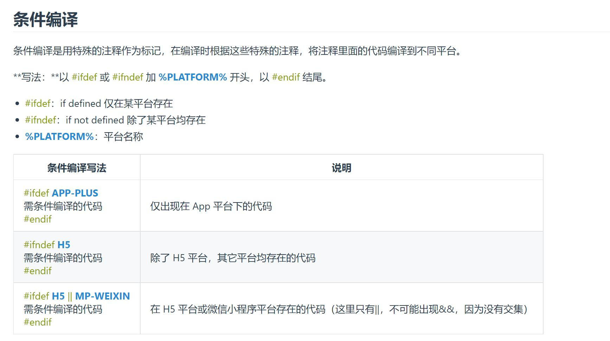
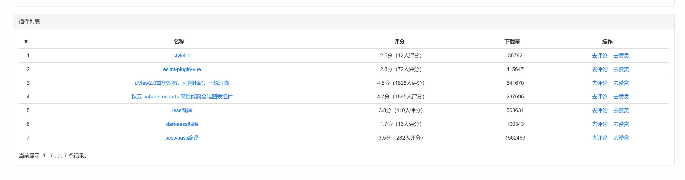

## 概述
该项目基于[`uniapp`](https://uniapp.dcloud.net.cn/)默认模板搭建，技术栈`vue2`
git地址[http://10.0.16.127:3000/ali-applet/uniapp-mPaaS.git](http://10.0.16.127:3000/ali-applet/uniapp-mPaaS.git)

## 项目主要结构
```
uniapp-mPaaS
├─ .gitignore
├─ App.vue
├─ components
│  └─ demo
│     └─ demo.vue
├─ config
│  ├─ baseApi.json
│  ├─ imgUrl.json
│  └─ index.js
├─ env.js
├─ index.html
├─ jest.config.js
├─ main.js
├─ manifest.json
├─ package.json
├─ pages
│  ├─ demo
│  │  └─ demo.vue
│  └─ index
│     └─ index.vue
├─ pages.json
├─ README.md
├─ README_files
│  ├─ 1.jpg
│  └─ 2.jpg
├─ services
│  ├─ index.js
│  ├─ request.js
│  └─ yzhRequest.js
├─ static
│  ├─ css
│  │  ├─ color.scss
│  │  ├─ common.scss
│  │  └─ flex.scss
│  ├─ image
│  └─ logo.png
├─ store
│  ├─ index.js
│  └─ modules
│     ├─ common.js
│     ├─ index.js
│     └─ userInfo.js
├─ uni.scss
├─ uni_modules
│  ├─ qiun-data-charts
│  └─ uview-ui

├─ utils
└─ 代码规范.md

```
## `uni_package`插件介绍
1. [uCharts](https://ext.dcloud.net.cn/plugin?id=271)
2. [uview-ui](https://ext.dcloud.net.cn/plugin?id=1593)
3. [uni-ui](https://uniapp.dcloud.net.cn/component/uniui/quickstart.html) 这个组件库是`uniapp`拓展组件 建议按需引入

>注：`uni_package`中的插件不用引用可以直接用，利用`easycom`自动引入规则实现 详情见[https://uniapp.dcloud.net.cn/collocation/pages.html#easycom](https://uniapp.dcloud.net.cn/collocation/pages.html#easycom)

## uniapp 注意事项
 1. 特殊编译语法
  
 >详见[文档](https://uniapp.dcloud.net.cn/tutorial/platform.html#%E8%B7%A8%E7%AB%AF%E5%85%BC%E5%AE%B9)
 
 2. 常用插件 
 
 
 3. 关于[跨端注意事项](https://uniapp.dcloud.net.cn/matter.html)
 4. 页面和组件是不能混用的 页面就是页面 组件就是组件 页面生命周期是按照小程序来 组件生命周期是组件 强行引入页面也不会执行js只会渲染页面
 5. 关于`import`数组解构引入的一点问题
 ```js
 // 错误 无法执行
 import { baseApi, env } from '@/config';
 import { request, ajax } from './request.js';
 
 // 正确
 import config from '@/config';
 import requests from './request.js';
 
 const { baseApi, env } = config;
 const { request, ajax } = requests;
 ```
 6. `components`中的组件在`vue`文件中并不需要引入 `uniapp`利用`easycom`自动引入
 7. [开发引入小程序自定义组件](https://uniapp.dcloud.net.cn/tutorial/miniprogram-subject.html#%E5%B0%8F%E7%A8%8B%E5%BA%8F%E8%87%AA%E5%AE%9A%E4%B9%89%E7%BB%84%E4%BB%B6%E6%94%AF%E6%8C%81)
 
 ## 性能优化
 ### 图片
1. 图标类图片采用svg矢量图，并采用雪碧图的方式使用
2. 大一点的图片采用图片服务器，并使用懒加载的方式引入，最好可以开发骨架屏